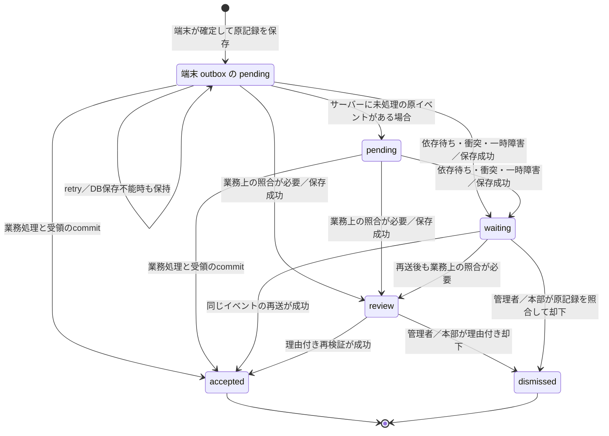

# 端末同期プロトコル

D0のAndroid端末・API間の契約。売上、開局、入出金、端末締めは同じoutboxと端末連番を使う。Roomはversion 4のままとし、解消状態・認証警告等の追加情報は既存metadataに保存する。

## 端末へ返す3値

`POST /v1/sync/events` の各 `results[]` は、送ったイベントの `id` と次の `status` を返す。`waiting` と `dismissed` はこの応答へ返さない。

| status   | 意味                                                 | 端末の処理                                               |
| -------- | ---------------------------------------------------- | -------------------------------------------------------- |
| accepted | 受領済み、または理由付き却下によって処理を終えた     | outboxをacceptedへ。原payloadと会計履歴は残す            |
| review   | サーバーに原イベントを保存済みで、業務上の照合が必要 | outboxをreviewへ。未送信から分け、要確認一覧へ表示       |
| retry    | 今回の業務処理が完了していない。永続化不能も含む     | outboxをpendingのまま保持し、同じID・連番・payloadで再送 |

acceptedは決済成功を推測する指示ではない。却下で終端した場合は、サーバーの解消情報と要確認履歴で判別する。サーバーで新しい売上・在庫移動を作ることなく再送を終える。

応答のIDが欠落・重複・未送信IDである場合、または未知statusの場合、端末は無関係なoutboxを更新しない。未確認のイベントはpendingに残す。通信切断で応答だけが失われても、次回は同じイベントを再送する。

## サーバーの5状態

| status    | 意味                                                      | 締めに使う終端か |
| --------- | --------------------------------------------------------- | ---------------- |
| pending   | 原イベントがあり、受領処理は未完了                        | いいえ           |
| accepted  | 売上等の業務処理とイベント受領を同じtransactionで確定     | はい             |
| review    | 業務ルール違反等を原イベントと一緒に保存し、人の照合待ち  | いいえ           |
| waiting   | 依存イベント待ち・連番衝突・一時障害。端末にはretryを返す | いいえ           |
| dismissed | 管理者／本部が理由・承認者を残して処理を終えた            | はい             |

図のlocalPendingは端末の状態であり、サーバーpending行が常に先に作られることを意味しない。通常の成功処理はaccepted行を直接commitする。

DB自体が利用不能ならサーバーにwaitingを保存できない。この場合もretryを返し、端末に原イベントを残す。保存に失敗したreviewを返して端末の自動再送を止めてはいけない。保存不能時のcodeは `SYNC_STORE_FAILED`、それ以外の未知障害のcodeは `SYNC_RETRY` とし、内部例外のmessageを応答へ出さない。

## ID、連番、隔離

イベントのIDは同じ確定操作を表し、端末連番は開局・売上・入出金・締めを通じて増える。payloadのキー順に依存しないSHA-256を検査する。再送時にID・連番・金額・税率・担当者・leaseを書き換えない。

売上・在庫・変更履歴・受領行は同じtransactionに含まれる。受領行のINSERT失敗を含む障害でrollbackし、未受領の処理を再送できる。通常の受領の証跡はこれらの原記録と変更履歴であり、理由付き再検証・却下は別途auditへ記録する。未知障害が1件発生したバッチは残りの業務処理を打ち切り、残りもretryとする。保存可能な原イベントはwaitingとして残す。

既に別のイベントが使う連番、または既存IDに異なるpayloadが来た場合は `device_event_quarantine` に隔離する。既存acceptedの内容を上書きしない。隔離表はtenant/storeのFORCE RLSを持ち、連番の一意制約を持たない。隔離行も未解消なら日締め・棚卸を止める。却下した重複連番を完了連番として二重に数えない。

単一開局の制約に当たる開局は `SHIFT_OPEN_CONFLICT` として既存開局を提示する。承認者が既存開局へ対応付けて解消した後、後続の売上・入出金・締めは対応先の開局を使用する。対応先の `shiftId` と `opening` を解消情報に含め、端末の現開局が元イベントを指している場合だけ開局IDと準備金を更新する。原payloadとhashは保持する。

## 解消と差分配信

`POST /v1/sync/reviews/:id/retry` は管理者・本部・店長の理由付き再検証、`POST /v1/sync/reviews/:id/dismiss` は管理者・本部の理由付き却下。対象店舗の権限と原記録を確認し、operationIdによる重複処理防止、audit、却下の承認者・理由を記録する。受領済みの別イベントを巻き戻さない。

管理用一覧はmain/quarantineの `source` を返す。同じIDが両表にある場合、解消操作のbodyへ `source='main'|'quarantine'` を指定して対象を選べる。指定を省略した場合は未解消の行を優先する。対象IDだけを見て既存acceptedを削除・上書きしない。

解消のcommitと同じtransactionでchangesへ `kind='device-event'`、`entity_id=<イベントID>`、bodyの `id/status` を記録する。差分のstatusはサーバー5状態を表し、端末はaccepted/dismissedをaccepted、pending/waitingをpending、reviewをreviewへ写す。売上以外の開局・入出金・締めにも適用する。

Androidは端末ID付きの `/v1/sync/reviews?storeId=...&deviceId=...` で同じ店舗・登録端末のreviewだけを照合する。deviceIdを省略した管理用一覧はreview/waiting/pendingを返し、管理者・本部・店長が確認できる。ローカルreviewがサーバー一覧に無ければ、pendingへ戻して同じpayloadを再送する。サーバーの終端行は再送にacceptedを返すため、差分の取り逃しも解消できる。未確定会計や他端末の記録は巻き戻さない。

## 分割、件数、締め

送信は端末連番順に、同じleaseの連続区間から最大100件・実JSONのUTF-8で256KiB以内へ分割し、pendingが無くなるまで進める。過去leaseの回収tokenはそのleaseに対応するバッチだけへ使う。全件retryや進捗なしでは送信ループを止めて次回へ回し、無限再送しない。

サーバーJSON上限は同期4MiB、商品CSV import5MiB、その他256KiB。413は `PAYLOAD_TOO_LARGE`、`retryable:false`、日本語案内、`nextAction='分割して再送'`。Androidは複数件バッチの件数を減らす。1件でも超過する場合は原記録を残して管理者に案内し、同じbodyを連打しない。

`pendingCount` は端末outboxのpendingだけ、`reviewCount` はreviewだけを数える。確認待ち外部決済は会計の別状態であり、reviewを未送信に加えない。端末statusのpendingは締めを止めるためoutbox pendingと確認待ち会計の合計を送り、reviewは別に送る。商品再取得はpendingと確認待ち会計が0であることを確認する。reviewだけが残る場合は商品再取得を妨げない。

端末締めの先行連番はaccepted/dismissedだけで完了を判定する。店舗日締め・棚卸開始は端末の同期状態と未解消イベントを確認する。棚卸開始後のreviewを全ID・理由付きで照合する既存手順を保持し、waitingは照合だけで完了にしない。

## 認証と受入

Android専用Cognito public clientはPKCE、callback `regipos://oauth`、refresh有効期間30日。Web clientと別のIDを設定し、APIは両audienceを検証する。client切替時は旧clientのtokensを破棄する。`invalid_grant` はtokensを破棄し、再ログイン成功までヘッダーに「管理者の再ログインが必要」を表示する。会計・outboxを消さない。

refreshの期限は最初のログインから数える。更新しても元の有効期間を延長しないため、30日を超える継続をこの設定だけで保証しない。[AWSのrefresh token仕様](https://docs.aws.amazon.com/cognito/latest/developerguide/amazon-cognito-user-pools-using-the-refresh-token.html)。時計を進めたローカル試験と、Macから配備して行うsandboxの累計実時間試験を別に記録する。

障害注入、実PGの受領・rollback・RLS、HTTP大容量、dismiss後の締め、AndroidのRoom/HTTP/再起動試験を組み合わせる。DB再起動中の100件同期とCognito実時間の受入は、ローカル試験の成功から推定せず、配備後の記録を必要とする。
