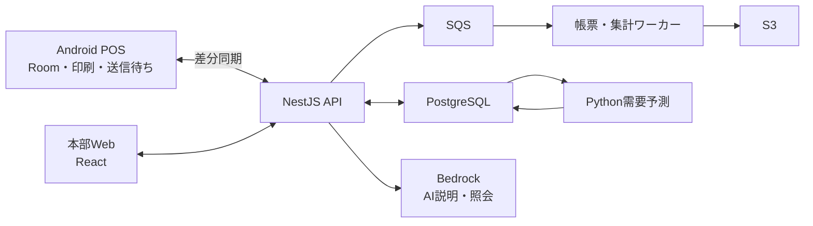

# REGI 詳細設計・実装・販売準備計画

## 2026-10-02の対象業種の明確化

利用者の追加指定により、主対象は飲食店とする。共通の販売・仕入・在庫基盤は維持し、店内飲食・持ち帰りの税区分、税率別の領収書・返還伝票、適用日時付き税率履歴を優先して検証する。将来の軽減税率変更については、確定した制度・適用日を確認して設定し、未確定の税率や開始日をコードへ固定しない。この指定だけで厨房連携・予約等の初期対象外機能を追加したり、既存のデモ取引を上書きしたりしない。

## 1. 製品仕様と完成の定義

**税込528万円で販売する、1法人・最大5店舗・24か月利用のAI搭載スマートレジを開発する。** Android POS、本部管理、受発注、在庫、AIを一つの標準製品として提供する。

本書を実装の基準とする。未指定だった仕様は以下の既定値で固定する。

| 項目       | 確定仕様                                                                                     |
| ---------- | -------------------------------------------------------------------------------------------- |
| 販売価格   | 税抜480万円／税込528万円                                                                     |
| 利用範囲   | 1法人、5店舗、各店舗2台、合計10台、スタッフ100名                                             |
| 利用期間   | 法人単位の利用開始日から24か月。店舗追加で期間は延長しない                                   |
| 更新       | 12か月・税抜240万円を標準とし、明示的な更新契約を必要とする                                  |
| 商品数     | 法人全体で最大5万SKU                                                                         |
| 通貨・言語 | 日本円・日本語                                                                               |
| 対象業務   | 小売・飲食・サービス業に共通する販売、仕入れ、在庫管理                                       |
| 決済       | 現金、既存端末によるカード・QR。1会計につき1支払方法                                         |
| 標準機器   | Galaxy Tab Active5 Pro、Epson TM-m30III-HのLAN接続                                           |
| 別料金     | 機器、現地設置、移行代行、研修、有人運用支援                                                 |
| 初期対象外 | 量り売り、掛売り、複数支払方法の併用、ポイント、予約、厨房連携、会計帳簿、決済端末の自動連携 |

サービス商品は在庫管理を無効にして扱う。飲食は店内・持ち帰りの税区分に対応する。業種専用機能は初期版に追加しない。

完成は次の3段階で判定する。

1. **製品完成：** 実機で販売・受発注・在庫・返品・締めが一貫して動き、通信断・復旧・権限の検証に合格する。
2. **販売準備完了：** 導入手順、利用規約、料金表、サポート手順、実導入事例、登録申請資料が揃う。
3. **補助金利用販売の開始条件充足：** 専用要領との照合、必要な事業者・ツール登録、対象となる契約手順を確認する。

## 2. 画面と業務ルール

### 画面設計

| 画面               | 主な入力・表示                                               | 完了する操作                |
| ------------------ | ------------------------------------------------------------ | --------------------------- |
| 開局・スタッフ選択 | 店舗、端末、担当者、釣銭準備金                               | 担当者認証、レジ開始        |
| 商品販売           | 商品検索、バーコード、商品ボタン、数量、値引き、カート、合計 | 商品追加、保留、会計へ進む  |
| 会計               | 支払方法、現金預り額、釣銭、外部決済の確認番号               | 支払確認、売上確定、印刷    |
| 取引履歴           | 日時、番号、担当者、金額、同期・返品状態                     | 再印刷、返品開始            |
| 返品               | 元取引、返品数量、理由、再入庫の可否                         | 管理者承認、返金結果記録    |
| 締め               | 支払方法別売上、現金入出金、実際の現金残高、差額             | 端末締め、照合              |
| 同期状況           | 未送信件数、最終同期、要確認取引                             | 再送、問題の確認            |
| 本部ダッシュボード | 店舗別売上、概算粗利、在庫、欠品候補、AI日報                 | 店舗・期間を指定した分析    |
| 商品・価格         | SKU、JAN、名称、分類、税区分、価格、標準原価、在庫管理設定   | 登録、CSV取込、価格変更予約 |
| 発注・入荷         | 仕入先、商品、数量、仕入単価、予定日、入荷数                 | 発注承認、PDF出力、分納入荷 |
| 在庫               | 店舗別数量、増減履歴、棚卸、移動                             | 棚卸確定、移動、廃棄・調整  |
| AI                 | 需要予測、推奨発注、質問、根拠、データ更新日時               | 発注下書き、集計照会        |
| 管理設定           | 店舗、スタッフ、権限、端末、税率履歴、契約                   | 利用範囲の管理              |

POS販売画面は横向きを基本とし、左側に商品、右側にカート、下部に合計・会計ボタンを固定する。通信状態は常時表示する。

業務エラーは「原因」と「次にできる操作」を表示する。保存中は二重操作を防ぐが、画面上のボタン制御だけに依存せず、API・DBでも重複を防止する。

### 販売と支払確認

売上は `下書き → 支払確認中 → 確定` と進む。未確定の会計は保留・中止できる。確定後は削除せず返品で処理する。

- 現金は預り額が合計以上であることを確認して確定する。
- カード・QRは店員が既存端末へ金額を入力し、成功結果を確認してPOSへ記録する。
- 外部決済の確認前に、会計内容を端末へ保存する。アプリが停止しても同じ会計を復元する。
- 結果不明の会計は「確認待ち」として残す。自動的に成功・失敗へ変更しない。
- 売上確定時に、明細・支払い・在庫減少予定・送信待ちイベントを端末内で一括保存する。
- 印刷は保存後に実行する。印刷失敗や再印刷で売上を再作成しない。

### 価格・値引き・税計算

価格入力方式は法人単位で「税込」または「税抜」を選び、初期値は税込とする。初期版では同一会計内の入力方式を統一する。

計算手順は次の順番に固定する。

1. 単価×数量から明細金額を求める。
2. 商品単位の値引きを適用する。
3. 会計全体の値引きを、残額の比率で明細へ配分する。
4. 税率ごとに合算して税額を求める。
5. 税額の1円未満を切り捨て、請求額を確定する。

値引きの配分は、まず各明細の配分額を切り捨て、残りの1円を小数部分の大きい順に割り当てる。同順位は明細の表示順とし、配分合計を必ず値引き額と一致させる。

税額は一つの帳票につき税率ごとに1回だけ端数処理する。これは国税庁の説明に合わせる。[国税庁：端数計算](https://www.nta.go.jp/taxes/shiraberu/taxanswer/shohi/6371.htm)

税区分・税率は適用開始日時付きで管理し、将来の税率をプログラムへ直接埋め込まない。保留会計は支払い開始時に価格・税率を再確認する。外部決済開始後は金額を固定し、税率切替をまたぐ未完了会計は管理者による確認対象にする。

取引には商品名、単価、値引き配分、税率、請求額、適用ルールの版を保存する。マスター変更後も過去の帳票は変わらない。

### 返品・返金

返品は元取引があるものに限定し、元の販売店舗で、オンライン時に管理者が承認する。

- 元明細の販売数量から返品済み数量を引いた範囲だけ返品できる。
- 値引き後の税込支払額を販売数量へあらかじめ配分し、返品する個数分を返金する。端数の割当順も保存する。
- 全商品を返品したときの返金合計は、元の支払額と一致させる。
- 同一取引に対する未完了返品は1件に制限し、返金処理中の数量を予約する。
- 外部決済の返金は店員が端末で行い、結果を記録する。結果不明時は予約を自動解除しない。
- 再入庫可能な商品だけ在庫へ戻す。返品・返金・再入庫を別の事実として記録する。
- 返還伝票には元販売日、返還日、商品、税率別税込返金額、元の適用税率を記載する。初期版は税額表示ではなく適用税率表示を採用する。

適格返還請求書は、消費税額等または適用税率の記載が認められている。[国税庁：インボイスQ&A・問60](https://www.nta.go.jp/taxes/shiraberu/zeimokubetsu/shohi/keigenzeiritsu/pdf/qa/01-01.pdf)

管理用の税額配分と税務申告上の税額は区別し、初期版では申告用会計データの生成を行わない。

### 受発注・在庫・締め

発注は `下書き → 承認済み → 発行済み → 一部入荷 → 入荷完了` と進む。PDFは発行時点の内容を保存する。発行後の数量変更は履歴付き改訂とし、入荷済み数量より少なくできない。仕入先への送付は利用者が行う。

入荷確定は発注明細をロックして残数を検査し、入荷記録と在庫増加を同一トランザクションで保存する。誤入荷は元記録を消さず、取消記録を追加する。

在庫は増減履歴の合計から求める。残数を直接上書きする機能は設けない。

- 販売によるマイナス在庫は許容し、警告・調整対象として表示する。
- 店舗間移動は `出庫 → 移動中 → 受入` とし、移動中は到着店舗の在庫へ含めない。
- 棚卸は全登録端末の未送信解消と販売停止の確認後に開始する。差分を調整記録として確定してから販売を再開する。
- 概算粗利は販売時に保存した標準原価で計算し、「標準原価による概算」と表示する。

各端末で釣銭準備金・現金入出金・実査額を管理する。通信断中の端末締めは暫定扱いとし、全端末の同期と確認待ち会計の解消後に店舗日締めを確定する。売上成立日と返品日は別々に保存し、過去日の売上を上書きしない。

## 3. システム・DB・API設計

### 構成

- Android：Kotlin、Jetpack Compose、Room、WorkManager。
- 本部Web：React、TypeScript、Vite。
- API：NestJS、REST、OpenAPI。単一アプリ内で業務モジュールを分離する。
- DBアクセス：Prisma。RLS等のDB設定はSQLマイグレーションで管理する。
- 需要予測：Python、LightGBM。
- 本番：AWS東京リージョン、ECS Fargate、RDS PostgreSQL Multi-AZ、S3、CloudFront、Cognito、SQS、CloudWatch。
- 開発：コンテナ化したAPI・DB・ワーカーと、Androidエミュレーターで動作確認できる構成。
- インフラ構築手順：Terraformで再現可能にする。

端末内DBを表示・販売処理の基礎にし、送信待ちを永続保存する。[Android公式のオフライン設計](https://developer.android.com/topic/architecture/data-layer/offline-first)に沿って構成する。

### データモデル

| 領域 | 主要エンティティと制約                                                 |
| ---- | ---------------------------------------------------------------------- |
| 組織 | 法人、店舗、端末、スタッフ、店舗所属、契約。端末は1店舗に所属          |
| 商品 | 商品、JAN、価格履歴、税率履歴、標準原価、仕入先別商品。SKUは法人内一意 |
| 売上 | 売上、明細、支払い、帳票。確定後の金額・明細は更新不可                 |
| 返品 | 返品、返品明細、返金確認。元売上・元明細を必須参照                     |
| 仕入 | 発注、発注明細、改訂、入荷、仕入返品                                   |
| 在庫 | 在庫移動台帳、残高、棚卸、店舗間移動。元イベントごとの重複登録を禁止   |
| 営業 | 端末開閉局、現金入出金、店舗日締め                                     |
| 同期 | 端末送信イベント、サーバー受信記録、変更履歴、同期位置                 |
| AI   | 予測結果、モデル版、発注提案、質問履歴、利用枠                         |
| 監査 | 操作者、操作対象、変更内容、理由、承認者、日時                         |

すべての業務データに法人IDを付ける。金額は整数円で保存し、JSONでは桁落ちを避けるため整数文字列として受け渡す。日時はUTCで保存し、画面は日本時間、営業日の区切りは初期値午前5時とする。

### APIの主要契約

| API                                      | 用途・重要な動作                                          |
| ---------------------------------------- | --------------------------------------------------------- |
| `POST /v1/devices/enroll`                | 管理者認証後、店舗と端末を関連付ける                      |
| `GET /v1/sync/bootstrap`                 | 商品・設定・権限と初回同期位置を取得                      |
| `POST /v1/sync/events`                   | 端末イベントを最大100件送信。イベントごとの処理結果を返す |
| `GET /v1/sync/changes?cursor=...`        | 法人・店舗権限内の変更を取得                              |
| `GET/POST/PATCH /v1/products`            | 商品管理。更新競合は版番号で検出                          |
| `POST /v1/refunds`                       | 返品下書きを作成し、返品可能数量を予約                    |
| `POST /v1/refunds/{id}/confirm`          | 返金確認と返品確定を一括実行                              |
| `POST /v1/purchase-orders`               | 発注作成                                                  |
| `POST /v1/purchase-orders/{id}/approve`  | 権限を検査して承認                                        |
| `POST /v1/purchase-orders/{id}/receipts` | 入荷確定と在庫反映                                        |
| `POST /v1/stocktakes`                    | 端末停止・同期状態を確認して棚卸開始                      |
| `POST /v1/transfers`                     | 店舗間移動を作成                                          |
| `GET /v1/reports/*`                      | 売上、支払、在庫、概算粗利の集計                          |
| `POST /v1/ai/query`                      | 権限内の集計照会                                          |
| `POST /v1/exports`                       | CSV・帳票一式を非同期生成                                 |

金額・在庫を動かすAPIは、操作IDによって同一要求の再送を識別する。同一ID・同一内容は元の結果を返し、同一ID・異なる内容は競合として拒否する。

エラーは業務コード、対象項目、再試行可能かどうかを返す。発注・返品・在庫更新の競合はDBトランザクションで防止する。

### 同期と通信断

- 端末イベントは、イベントID、端末ID、端末内連番、担当者、発生日時、ルール版、内容を持つ。
- 端末はサーバーから処理完了を受け取るまで送信待ちを削除しない。
- サーバーは法人内のイベントIDを一意にし、売上・在庫・処理済み記録を同時に確定する。
- 差分取得は法人単位のコミット順変更番号を使う。端末時計の前後によって変更を取りこぼさない。
- 自動再送は指数的に間隔を延ばす。回復時とアプリ起動時にも同期する。
- 不正な形式や計算不整合は「要確認」に保存し、端末の元記録を失わない。
- 価格・設定変更は履歴として配信する。既に成立した売上へ遡及適用しない。

オフライン販売は、最後に取得した認証・契約情報の有効範囲内で最大72時間とする。返品・発注承認・棚卸確定・店舗間移動はオンライン時に限る。

契約失効や認証期限切れ後も、期限内に成立した未送信売上の回収経路は維持する。新規販売を止める処理と、既存データを回収する処理を分ける。

### 権限

- 法人管理者：全店舗、スタッフ・契約・端末管理。
- 本部担当：全店舗の業務管理、価格、発注、分析。
- 店長：担当店舗の返品承認、発注承認、在庫調整、締め。
- レジ担当：担当店舗の販売、履歴、再印刷、発注下書き。

本部ログインと管理者操作にCognitoを使用し、管理者はMFAを必須とする。レジ担当者の切替は登録端末内のPINで行い、認証済みの店舗所属と権限を検査する。

法人分離はAPIとPostgreSQL RLSの両方で実施する。アプリのDB利用者に所有者権限やRLS回避権限を与えない。[PostgreSQL公式：行セキュリティ](https://www.postgresql.org/docs/17/ddl-rowsecurity.html)

## 4. AI・運用・販売資料

### AIの仕様

需要予測と生成AIを分けて実装する。

**需要予測**

- 店舗・商品・営業日別に販売数を集計する。
- 同期未完了の日を「販売ゼロ」と扱わない。
- 56日以上の履歴がある商品を対象とし、法人ごとに学習する。
- 時系列を守った検証で曜日別平均と比較する。誤差が小さいモデルだけ採用する。
- 翌7日分を毎日更新し、モデル版・学習期間・予測日時を保存する。
- 履歴不足や精度不足は基準在庫方式へ切り替え、画面上で方式を表示する。

発注推奨数量は、納期中の予測需要＋安全在庫−現在庫−未入荷発注残から求め、最低発注数と発注単位へ切り上げる。提案は発注下書きまでとする。

**生成AI**

- 初期モデルはBedrockのClaude Haiku 4.5、日本国内推論プロファイル。
- 売上、支払、概算粗利、商品比較、在庫、発注残を照会対象とする。
- AIには用意した集計APIだけを使用させ、自由なSQLやDB更新を許可しない。
- 個人名、PIN、決済情報、不要な取引先情報を入力に含めない。
- 回答には対象店舗・期間・更新日時・根拠の集計画面へのリンクを付ける。
- 数値は集計APIの結果から表示し、生成文章による数値の書換えを防ぐ。

初期契約は月5,000回、1回の入力上限12,000トークン、出力上限2,000トークン。日報も利用回数に含める。回数はサーバーで予約・確定し、同時実行でも超過させない。技術的失敗時は枠を戻し、超過による自動課金は行わない。

AI停止時も販売・受発注は継続する。予測と日報には更新日時を表示し、古い結果を最新として扱わない。

### 運用

- クラウド稼働率の設計目標は月99.9%。
- 同期済みデータの目標はRPO 5分、RTO 4時間。
- RDSは35日分の自動バックアップと時点復元を設定し、復元訓練を行う。[AWS公式：バックアップ・復元](https://docs.aws.amazon.com/AmazonRDS/latest/gettingstartedguide/managing-backup-restore.html)
- API障害、同期滞留、処理エラー、AI利用量、バックアップ失敗、クラウド費用を監視する。
- 本番更新は検証環境 → パイロット端末 → 全体の順に行う。
- Androidアプリは署名付きで配布し、未送信売上がある状態のデータ初期化を防ぐ。
- DB変更は旧版アプリとの移行期間を設け、更新失敗時に既存販売を止めない。

未同期の端末そのものが破損・紛失した場合は、クラウドのRPOでは保護できない。画面に未送信件数を常時表示し、店舗運用として日々の同期確認を組み込む。

契約中は取引と帳票を保管する。終了後30日は閲覧・出力を可能とし、90日後の業務データ削除を専用保守接続で実施する。単一EC2のバックアップは現行版35日と非現行版35日のライフサイクルにより、単純な上書きの例で約70日残る。複製未成功のオブジェクトはさらに残る場合があり、35日以内の完全消去を保証しない。データ出力機能と終了時の扱いを利用規約に記載する。

### 登録・販売資料

登録申請資料には、製品名・プラン、実画面、業務フロー、対応端末写真、クラウド構成、AI機能、利用方法、料金表、導入実績をまとめる。

特に、次の3つを実物で説明する。

- Androidアプリをインストールして販売・決済記録ができる。
- 発注作成から承認、発注書、入荷まで一連の受発注ができる。
- AIが実データを使って予測・提案・説明を行う。

完成・一般販売と機能・価格資料を前提に準備する。[ITツール登録要領](https://it-shien.smrj.go.jp/pdf/it2026_touroku_it_tool.pdf)

価格の根拠は機能・利用規模・契約期間と、実測した改善効果で説明する。導入前後の発注時間、締め時間、欠品件数、在庫量を記録し、確認できた成果だけを導入事例に掲載する。

通常のスマートレジ条件は現行ITツール登録要領と[公式スマートレジ案内](https://it-shien.smrj.go.jp/smartregistersystem/)で照合する。09-24のお知らせで専用公募要領が後日公開とされているのは、2027年1月開始予定の事前着手制度の別条件である。この制度を利用する販売では、追加要領の対象経費・登録時期・必要書類を改めて確認する。[事務局のお知らせ](https://it-shien.smrj.go.jp/news/40184)

## 5. 実装順・受入試験・モデル移管

### 実装工程

| 段階        | 完成させるもの                                        | 次へ進む条件                     |
| ----------- | ----------------------------------------------------- | -------------------------------- |
| 1. 基盤     | 開発環境、認証、法人分離、DB、API契約、計算ライブラリ | 権限試験と計算試験が合格         |
| 2. 販売     | 商品、Android POS、現金・外部決済記録、印刷、同期     | 実機で販売と再起動・再送が成立   |
| 3. 店舗業務 | 返品、締め、発注、入荷、在庫、棚卸、移動              | 一連の業務で数量・金額が一致     |
| 4. 本部・AI | 集計、CSV、需要予測、発注支援、日報、照会             | 根拠・権限・利用上限の検証が合格 |
| 5. 運用     | 本番構築手順、配布、監視、復旧、マニュアル            | 負荷試験と復元訓練が合格         |
| 6. 販売準備 | 実店舗検証、価格資料、実績、登録申請一式              | 不具合解消と資料レビューが完了   |

実装成果物は、ソースコード、OpenAPI、DBマイグレーション、画面仕様、テスト、環境構築手順、署名付き配布手順、運用手順、登録資料とする。

### 必須受入試験

| 対象       | 合格条件                                                             |
| ---------- | -------------------------------------------------------------------- |
| 税・値引き | 複数税率、税込・税抜、全額値引き、1円配分、税率変更で期待値と一致    |
| 返品       | 部分返品を繰り返しても過剰返金せず、全返品時に元の支払額と一致       |
| 二重操作   | 会計・返金・入荷の連打、タイムアウト後の再送でも二重計上しない       |
| 通信断     | 最大72時間の断続的通信断、アプリ再起動、順序違いの再送から復旧できる |
| 外部決済   | 決済直後のアプリ停止でも未完了会計から照合できる                     |
| 在庫       | 分納、取消、返品、移動、棚卸後に増減履歴と残高が一致                 |
| 帳票       | 保存済み取引と印刷・PDFの金額が一致し、再印刷で売上が増えない        |
| 権限       | 他法人・未許可店舗へのAPI、CSV、AI経由のアクセスを拒否               |
| AI         | 根拠の数値が一致し、データ不足を表示し、利用枠を超過しない           |
| 性能       | 5万SKUで商品操作の95%が300ms以内、端末内売上確定が1秒以内            |
| 負荷       | 100端末・毎秒10会計の想定負荷で、クラウド取込の95%が2秒以内          |
| 復旧       | 本番相当データから目標RPO・RTOを実測する                             |
| 終了・更新 | 契約更新、終了後の出力、期限内の未送信売上回収が成立                 |

税計算はKotlinとTypeScriptで同じ検証データを使う。DB試験は実際のPostgreSQLを使い、RLSと同時更新を検証する。Webは操作テスト、Androidはエミュレーターと指定実機で確認する。

**設計段階では、値引き配分と個数単位の返金配分を1万ケースで検証し、金額保存の性質を確認済み。製品の実装試験・実機試験はこれから行う。**

### 指定モデルへの移管

Conductorのモデル一覧で、**`gpt-6.1-sol`と推論強度`ultra`が利用可能**なことを確認済み。

実装時は、このワークスペース内に同モデル・同強度の実装セッションを作成し、本書全体を引き継ぐ。ブランチは変更せず、第1段階から実装・検証を順に進める。

**現在はPlanモードのため、実装セッションはまだ起動していない。実装開始に必要な操作はPlanモードの解除。解除後は追加の仕様確認を挟まず、本設計で着手する。**
